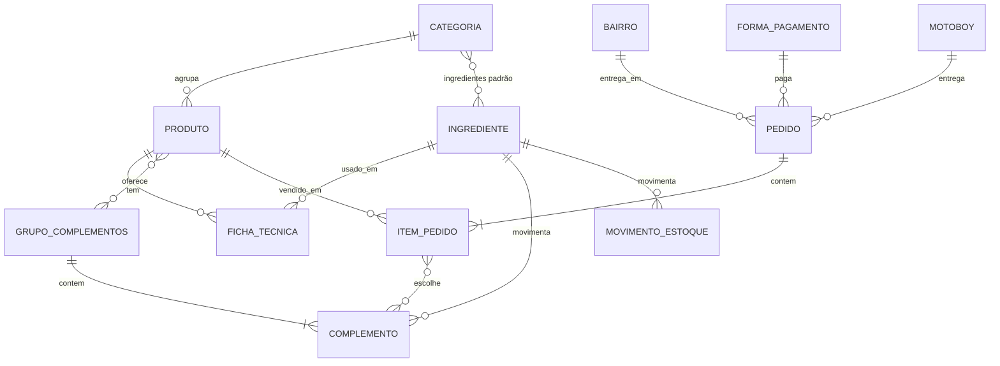

# Modelo de dados inicial

Sprint 1 · Item 4 · Responsável: Lucas Sol, com apoio de Anna Hermes

Ponto de partida tirado do levantamento de requisitos. Nomes e campos ainda podem mudar. Quando as entidades forem criadas em `src/entity/`, as tabelas passam a ser geradas pelas migrations.

**Banco escolhido:** PostgreSQL (justificativa em [stack-backend.md](stack-backend.md)).

| Entidade | Campos principais |
|---|---|
| Categoria | nome, ordem, ingredientes padrão, ativo |
| Ingrediente | nome, unidade (un ou kg), saldo atual, estoque mínimo |
| Produto | nome, categoria, descrição, preço, ativo |
| Ficha técnica | produto, ingrediente, quantidade média, unidade de medida (un, g ou kg) |
| Grupo de complementos | nome, obrigatório, mínimo, máximo, produtos ligados |
| Complemento | grupo, nome, preço extra, ingrediente, quantidade (soma ou desconta do estoque) |
| Movimento de estoque | ingrediente, tipo (entrada ou saída), quantidade, data, pedido de origem |
| Pedido | data e hora, tipo (entrega ou retirada), endereço, bairro, taxa, forma de pagamento, valor recebido e troco, motoboy, status, prazo estimado, total |
| Item do pedido | pedido, produto, quantidade, preço unitário gravado, complementos escolhidos, subtotal |
| Bairro | nome, taxa de entrega |
| Forma de pagamento | nome, ativo |
| Motoboy | nome, valor fixo por noite |

## Módulos do MVP cobertos

| Módulo | Entidades |
|---|---|
| Cardápio | Categoria, Grupo de complementos, Complemento |
| Produtos | Produto, Ficha técnica |
| Vendas | Pedido, Item do pedido, Bairro, Forma de pagamento, Motoboy |
| Estoque | Ingrediente, Movimento de estoque |

## Pontos para decidir com a equipe

- O **pedido grava uma cópia da taxa do bairro e do preço de cada item** (RN5), para que os relatórios antigos não mudem se os valores forem alterados depois.
- O **saldo do ingrediente** pode ser uma coluna atualizada a cada movimento, ou calculado somando os movimentos. A coluna é mais simples para o alerta de estoque (R33).
- **Unidades**: guardar o estoque sempre na unidade base do ingrediente (un ou kg) e converter g → kg na baixa (RN3).
